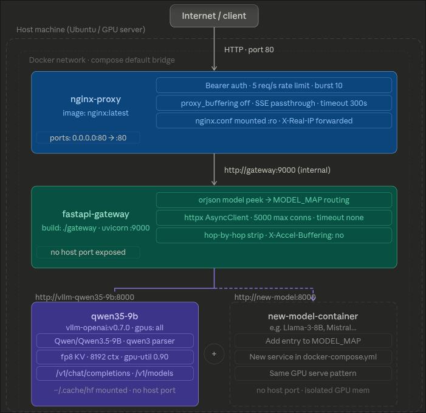

# Model Experimentation Repository



This repository contains configurations for running various open-source large language models using different serving technologies. Each top-level directory corresponds to a specific model, and subdirectories often contain configurations for different serving backends like `vllm` and `sglang`.

## Project Structure

The repository is organized by model, with each model having its own directory. Inside each model's directory, you will find the necessary files to run the model in a containerized environment using Docker and Docker Compose.

Here is a brief overview of the common files you'll find in each directory:

-   `docker-compose.yml`: The Docker Compose file to orchestrate the services.
-   `.env`: Environment variable file for configuration (e.g., model paths, ports).
-   `nginx.conf`: NGINX configuration for reverse proxying requests to the model server.
-   `gateway/`: A directory containing a FastAPI-based gateway to interact with the model.
    -   `Dockerfile`: Dockerfile for building the gateway service.
    -   `main.py`: The Python source code for the gateway.
-   `sglang/` or `vllm/`: Subdirectories for specific serving technologies.

## Available Models

This repository includes configurations for the following models:

-   **gemma4-e2b** (`sglang`)
-   **gemma4-e4b** (`sglang`)
-   **ministral3-3b-inst** (`sglang`, `vllm`)
-   **ministral3-8b-inst** (`vllm`)
-   **nemotron3-nano-4b** (`sglang`, `vllm`)
-   **qwen35-0.8b** (`sglang`, `vllm`)
-   **qwen35-2b** (`sglang`, `vllm`)
-   **qwen35-4b** (`sglang`, `vllm`)
-   **qwen35-9b** (`sglang`, `vllm`)

## General Deployment Instructions

To deploy any of the models in this repository, you will need to have Docker and Docker Compose installed.

1.  **Navigate to the model directory:**
    ```bash
    cd <model-directory>
    ```
2.  **Configure the environment:**
    -   Each model directory contains a `.env` file. You may need to edit this file to specify the path to the model weights on your local machine.
3.  **Deploy the model:**
    ```bash
    docker-compose up -d
    ```
4.  **Check the logs:**
    ```bash
    docker-compose logs -f
    ```
5.  **Interact with the model:**
    -   Once the model is deployed, you can interact with it through the API gateway. The default port is usually `8080`.

For detailed instructions, please refer to the `README.md` file inside each model's directory.

## License

This project is licensed under the Apache License, Version 2.0 - see the [LICENSE](LICENSE) file for details.